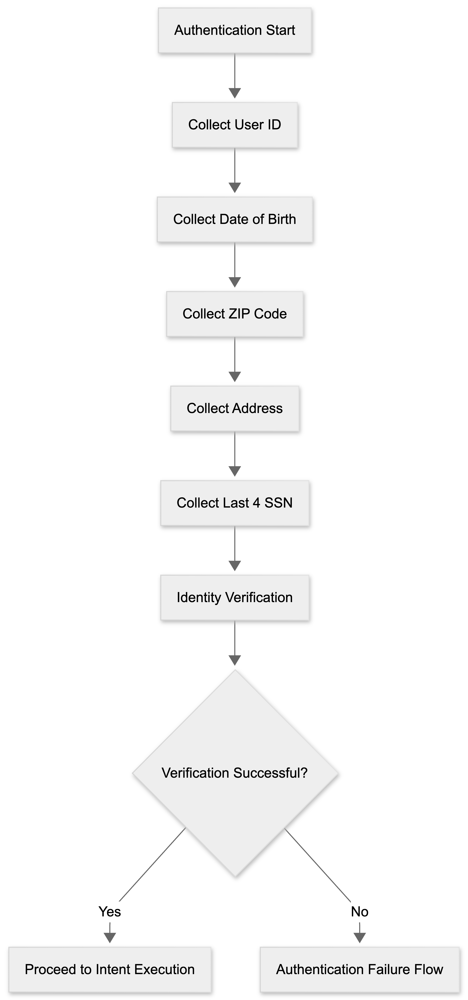

# Authentication Flow

The Authentication Flow is responsible for collecting the information required to verify the identity of members and providers before granting access to protected healthcare information.

Authentication is initiated only when the selected intent requires access to sensitive healthcare data.

## Authentication Information

The voice agent may collect:

- User ID
- Date of Birth
- ZIP Code
- Address Verification
- Last Four Digits of SSN when required

## Authentication Process

1. Request User ID.
2. Request Date of Birth.
3. Request ZIP Code or Address.
4. Request Last Four Digits of SSN when applicable.
5. Submit information for verification.
6. Continue to Identity Verification.

## Flow Diagram

## Flow Summary

- Collect authentication information.
- Validate user identity information.
- Forward information for verification.
- Continue to verification stage.
