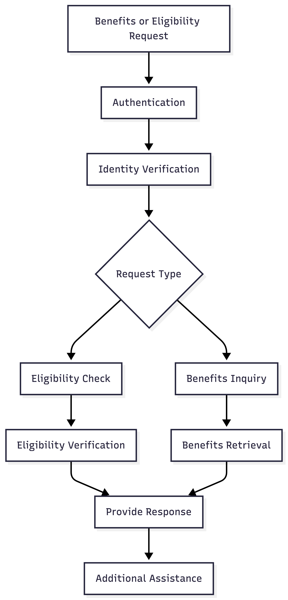

# Eligibility and Benefits Journey

The Eligibility and Benefits Journey allows authenticated users to verify healthcare coverage eligibility and obtain information regarding healthcare benefits.

Before eligibility or benefits information is disclosed, the user must complete authentication and identity verification.

## Supported Services

- Eligibility Check
- Benefits Inquiry

## Happy Path Flow

1. User requests eligibility or benefits information.
2. User completes authentication.
3. User completes identity verification.
4. The voice agent identifies the request type.
5. The voice agent retrieves eligibility or benefits information.
6. The information is provided to the user.
7. Additional assistance is offered.

## Flow Diagram

## Flow Summary

- Support eligibility verification.
- Support benefits inquiries.
- Retrieve coverage information.
- Provide healthcare plan details.
- Offer additional assistance before ending the conversation.
