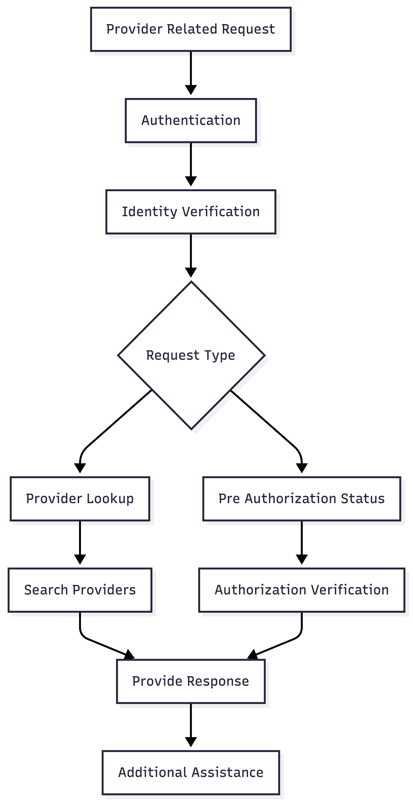

# Provider and Pre Authorization Journey

The Provider and Pre Authorization Journey allows authenticated users to search for healthcare providers and check the status of pre authorization requests.

Before provider or authorization information is disclosed, the user must complete authentication and identity verification.

## Supported Services

- Provider Lookup
- Pre Authorization Status

## Happy Path Flow

1. User requests provider or pre authorization information.
2. User completes authentication.
3. User completes identity verification.
4. The voice agent identifies the request type.
5. The requested information is retrieved.
6. A response is provided to the user.
7. Additional assistance is offered.

## Flow Diagram

## Flow Summary

- Support provider lookup requests.
- Support pre authorization status requests.
- Retrieve healthcare network information.
- Retrieve authorization information.
- Offer additional assistance before ending the conversation.
