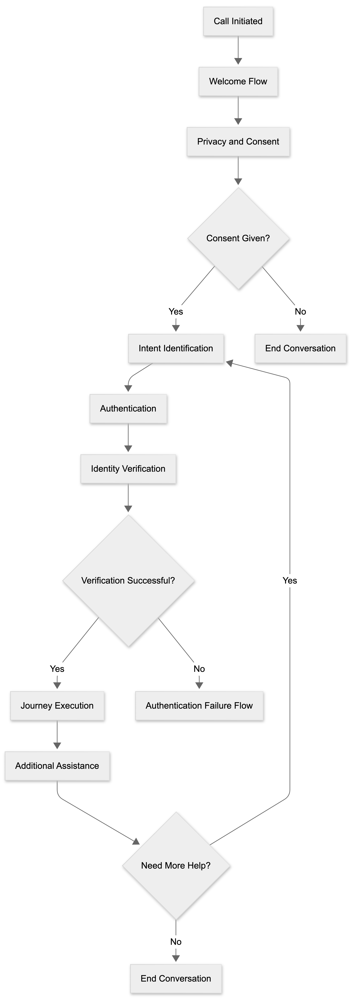

# Master Conversational Flow

The master conversational flow represents the high level interaction journey followed by members and providers while interacting with the Healthcare Claims Voice Agent.

The flow begins when a user contacts the healthcare support system and continues through consent collection, authentication, intent identification, service execution, and conversation closure.

## Flow Stages

1. Welcome
2. Privacy and Consent
3. Intent Identification
4. Authentication
5. Identity Verification
6. Intent Routing
7. Healthcare Service Journey
8. Additional Assistance
9. End Conversation

## Master Flow Diagram

