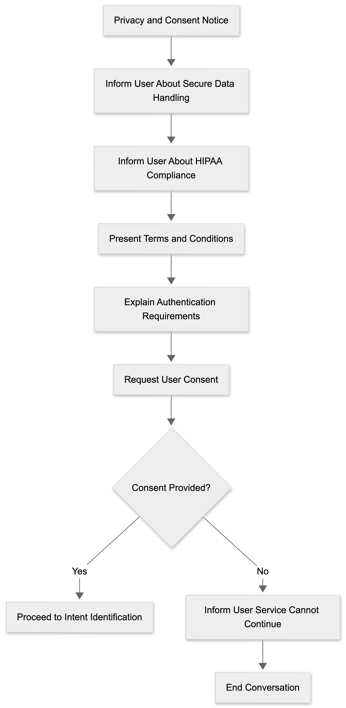

# Privacy and Consent Flow

The Privacy and Consent Flow ensures that users are informed about privacy requirements and agree to continue before accessing healthcare related services.

## Flow Diagram

## Terms and Conditions

Before continuing, users are informed that:

- Personal information may be collected for identity verification.
- Authentication is required before accessing protected healthcare information.
- Information is handled according to healthcare privacy requirements.
- Unauthorized access to healthcare information is restricted.
- Calls may be transferred to a human representative when required.
- The user must provide accurate information during authentication.
- The service is intended for authorized members and providers.

## Flow Summary

- Inform the user about privacy requirements.
- Present terms and conditions.
- Request user consent.
- Continue if consent is provided.
- End the conversation if consent is not provided.
