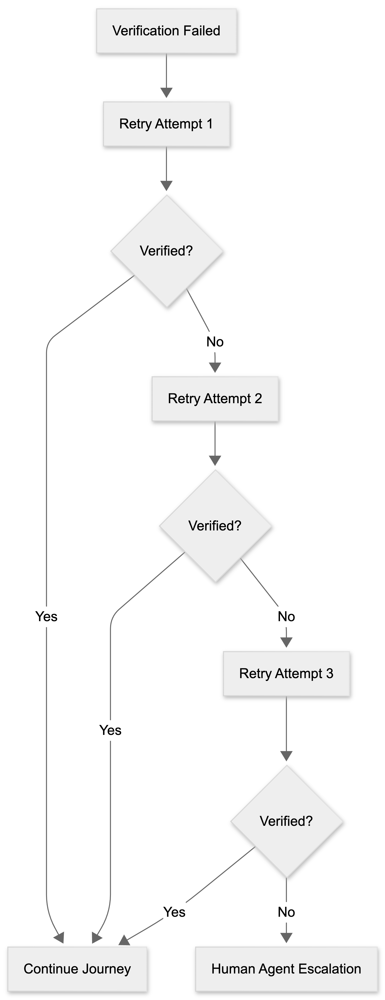

# Authentication Failure Flow

The Authentication Failure Flow handles scenarios where user verification is unsuccessful.

To maintain security and compliance, users are allowed a limited number of verification attempts before escalation.

## Failure Handling Process

1. Verification fails.
2. User is asked to try again.
3. Retry process continues for a maximum of three attempts.
4. Escalate to a human representative if verification remains unsuccessful.

## Escalation Rule

After three unsuccessful verification attempts, the conversation is transferred to a human agent.

## Flow Diagram

## Flow Summary

- Handle failed authentication attempts.
- Allow limited retries.
- Protect healthcare information.
- Escalate when verification cannot be completed.
