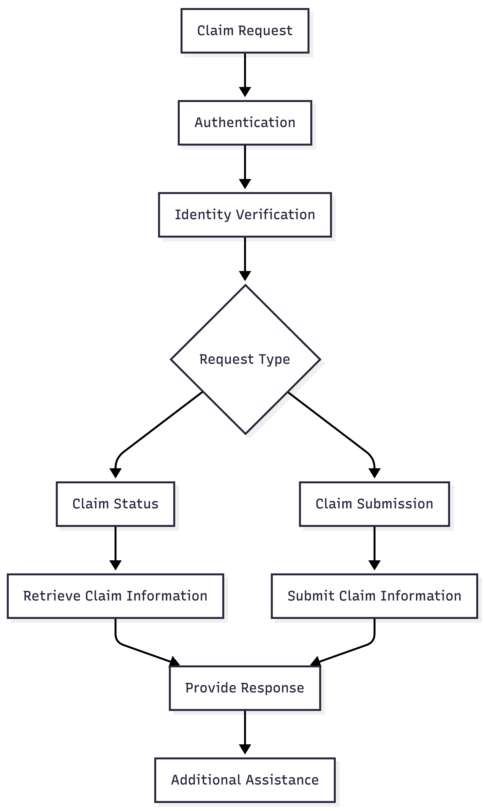

# Claims Journey

The Claims Journey supports users who want to check the status of an existing claim or submit a new claim.

Before claim related information is accessed or submitted, the user must complete authentication and identity verification.

## Supported Services

- Claim Status
- Claim Submission

## Happy Path Flow

1. User requests a claim related service.
2. User completes authentication.
3. User completes identity verification.
4. The voice agent identifies the request type.
5. The voice agent either retrieves claim information or accepts claim details for submission.
6. A response is provided to the user.
7. Additional assistance is offered.

## Flow Diagram

## Flow Summary

- Handle claim related requests.
- Support claim status inquiries.
- Support claim submission requests.
- Provide claim related responses.
- Offer additional assistance before ending the conversation.
