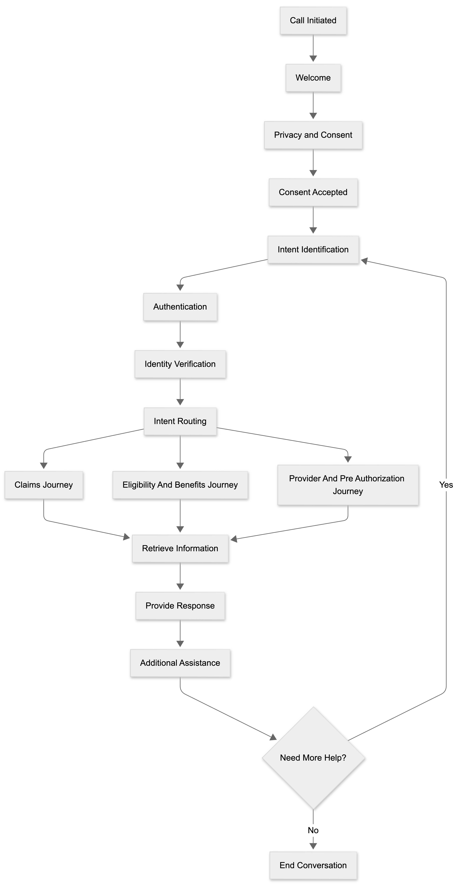

# Happy Path Conversational Flow

The Happy Path Conversational Flow represents the ideal end to end user journey where authentication is successful, the intent is correctly identified, and the requested healthcare information is successfully provided.

This flow combines all major healthcare service journeys and demonstrates the standard interaction path followed by members and providers.

## Flow Diagram

## Happy Path Summary

1. User initiates the conversation.
2. The voice agent greets the user.
3. Privacy and consent information is presented.
4. The user provides consent.
5. The voice agent identifies the user's intent.
6. Authentication is performed when required.
7. Identity verification is completed successfully.
8. The request is routed to the appropriate healthcare journey.
9. The requested information is retrieved.
10. A response is provided to the user.
11. Additional assistance is offered.
12. The conversation ends successfully.
