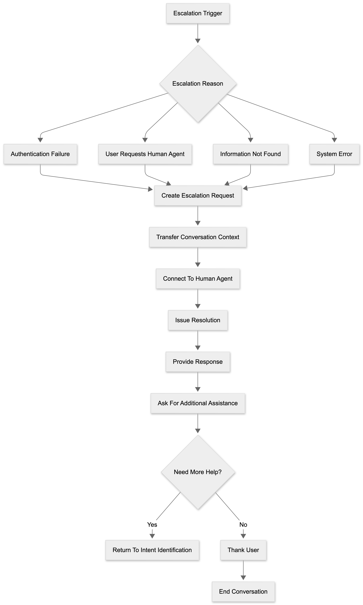

# Human Escalation and Closure Flow

The Human Escalation and Closure Flow handles scenarios where the Healthcare Claims Voice Agent is unable to successfully complete a user's request and assistance from a human representative is required.

The purpose of this flow is to ensure that users continue receiving support even when authentication cannot be completed, requested information is unavailable, system issues occur, or a user specifically requests to speak with a human representative.

## Escalation Scenarios

The conversation may be escalated under the following conditions:

- Authentication failure after three unsuccessful attempts
- User requests a human representative
- Requested information cannot be retrieved
- System or service failure occurs
- Unsupported request is received

## Escalation Process

1. The voice agent identifies an escalation trigger.
2. An escalation request is created.
3. Relevant conversation details are collected.
4. The conversation context is transferred.
5. The user is connected to a human representative.
6. The issue is reviewed and resolved.
7. The user receives the requested assistance.

## Conversation Closure

After the issue has been resolved, the voice agent or human representative confirms whether additional assistance is required.

If no further assistance is needed, the conversation is concluded.

## Flow Diagram

## Flow Summary

- Identify escalation scenario.
- Create escalation request.
- Transfer conversation context.
- Connect the user to a human representative.
- Resolve the issue.
- Offer additional assistance.
- End the conversation.
