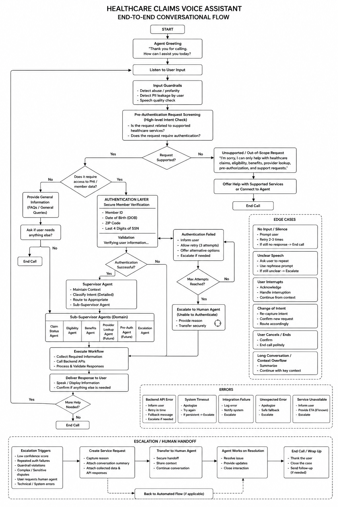

# End to End Conversational Flow with Edge Cases

This document represents the complete conversational journey for the Healthcare Claims Voice Agent.

The flow combines authentication, intent identification, healthcare service execution, error handling, edge case management, and human escalation into a single end to end interaction model.

The objective of this design is to ensure secure, compliant, and efficient handling of healthcare related requests while maintaining a seamless user experience.

## Overview

The conversation begins when a member or provider contacts the healthcare support center.

The voice agent greets the user, captures the request, determines whether authentication is required, verifies the user's identity when necessary, routes the request to the appropriate healthcare service journey, and delivers the requested information.

When issues occur, the voice agent follows predefined edge case handling procedures and escalates the conversation to a human representative when required.

## Supported Healthcare Services

- Claim Status
- Claim Submission
- Eligibility Check
- Benefits Inquiry
- Provider Lookup
- Pre Authorization Status
- Service Request
- Human Agent Escalation

## Authentication and Verification

When protected healthcare information is requested, the user must complete authentication and identity verification.

Authentication may include:

- User ID
- Date of Birth
- ZIP Code
- Address Verification
- Last Four Digits of SSN

Users are allowed a maximum of three authentication attempts.

After three unsuccessful attempts, the conversation is escalated to a human representative.

## Edge Cases Covered

### Consent Not Provided

If the user declines consent:

- The conversation cannot continue.
- Sensitive information is not disclosed.
- The call is ended politely.

### Authentication Failure

If verification fails:

- Retry authentication.
- Allow up to three attempts.
- Escalate after maximum retries.

### Unsupported Request

If the request falls outside supported healthcare services:

- Inform the user about supported services.
- Offer alternative assistance.
- Escalate when required.

### Unknown Intent

If the voice agent cannot determine user intent:

- Request clarification.
- Ask the user to rephrase.
- Escalate if intent remains unclear.

### Claim Not Found

If claim information cannot be located:

- Inform the user.
- Verify claim details.
- Escalate if necessary.

### Provider Not Found

If provider information is unavailable:

- Inform the user.
- Offer alternative search options.
- Escalate when required.

### System Error

If backend or system failures occur:

- Inform the user.
- Retry when possible.
- Escalate if the issue persists.

### User Requests Human Agent

If the user requests a live representative:

- Create escalation request.
- Transfer conversation context.
- Connect to a human representative.

## Human Escalation

Human escalation may occur due to:

- Authentication failures
- Unsupported requests
- System failures
- Information retrieval failures
- User request for human assistance

During escalation, conversation context is transferred to ensure continuity and reduce repetition for the user.

## Flow Diagram

## End to End Flow Summary

1. User initiates the conversation.
2. Voice agent greets the user.
3. User request is captured.
4. Intent is identified.
5. Authentication is performed when required.
6. Identity verification is completed.
7. Request is routed to the appropriate healthcare journey.
8. Information is retrieved and validated.
9. Response is delivered to the user.
10. Edge cases are handled when encountered.
11. Human escalation is triggered when necessary.
12. Additional assistance is offered.
13. Conversation is concluded successfully.
